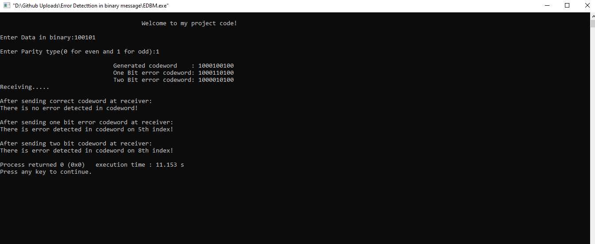

# Error-Detection-in-Binary-Message
Error Detection in Binary Message using Hamming Code algorithm implemented by C++ programming Language. This project takes a binary string as input. Then it inserts the parity bits inside the binary string and generates a codeword. Using the codeword another two codeword is generated that is one bit error codeword and another is two bit error codeword. And finally, those two codewords which has error in it are sent to the receiver. The receiver detects the error with the exact error position for one bit error codeword, although for two bit error codeword it can only detect the error not the exact position of error.

Output Snapshot:

